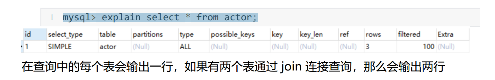
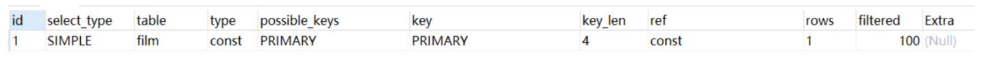
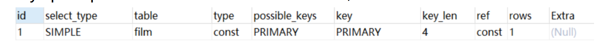

#Explain工具介绍
使用EXPLAIN关键字可以模拟优化器执行SQL语句，分析你的查询语句或是结构的性能瓶颈

在 select 语句之前增加 explain 关键字，MySQL 会在查询上设置一个标记，执行查询会返

回执行计划的信息，而不是执行这条SQL

注意：如果 from 中包含子查询，仍会执行该子查询，将结果放入临时表中

###Explain分析示例
````mysql
示例表：
 DROP TABLE IF EXISTS `actor`;
 CREATE TABLE `actor` (
 `id` int(11) NOT NULL,
 `name` varchar(45) DEFAULT NULL,
 `update_time` datetime DEFAULT NULL,
 PRIMARY KEY (`id`)
 ) ENGINE=InnoDB DEFAULT CHARSET=utf8;

 INSERT INTO `actor` (`id`, `name`, `update_time`) VALUES (1,'a','2017‐12‐2
 15:27:18'), (2,'b','2017‐12‐22 15:27:18'), (3,'c','2017‐12‐22 15:27:18');

 DROP TABLE IF EXISTS `film`;
 CREATE TABLE `film` (
 `id` int(11) NOT NULL AUTO_INCREMENT,
 `name` varchar(10) DEFAULT NULL,
 PRIMARY KEY (`id`),
  KEY `idx_name` (`name`)
 ) ENGINE=InnoDB DEFAULT CHARSET=utf8;

 INSERT INTO `film` (`id`, `name`) VALUES (3,'film0'),(1,'film1'),(2,'film
2');

 DROP TABLE IF EXISTS `film_actor`;
 CREATE TABLE `film_actor` (
 `id` int(11) NOT NULL,
 `film_id` int(11) NOT NULL,
 `actor_id` int(11) NOT NULL,
 `remark` varchar(255) DEFAULT NULL,
 PRIMARY KEY (`id`),
 KEY `idx_film_actor_id` (`film_id`,`actor_id`)
 ) ENGINE=InnoDB DEFAULT CHARSET=utf8;

 INSERT INTO `film_actor` (`id`, `film_id`, `actor_id`) VALUES (1,1,1),
(2,1,2),(3,2,1);

mysql> explain select * from actor;
````

###explain 两个变种
1）explain extended：会在 explain 的基础上额外提供一些查询优化的信息。紧随其后通
过 show warnings 命令可以得到优化后的查询语句，从而看出优化器优化了什么。额外还有
filtered 列，是一个半分比的值，rows * filtered/100 可以估算出将要和 explain 中前一个表
进行连接的行数（前一个表指 explain 中的id值比当前表id值小的表）。

mysql> explain extended select * from film where id = 1;

mysql> show warnings;

2）explain partitions：相比 explain 多了个 partitions 字段，如果查询是基于分区表的
话，会显示查询将访问的分区。

###explain中的列
接下来我们将展示 explain 中每个列的信息。
1. id列
id列的编号是 select 的序列号，有几个 select 就有几个id，并且id的顺序是按 select 出现的
顺序增长的。
id列越大执行优先级越高，id相同则从上往下执行，id为NULL最后执行。
2. select_type列
select_type 表示对应行是简单还是复杂的查询。
1）simple：简单查询。查询不包含子查询和union

mysql> explain select * from film where id = 2;
