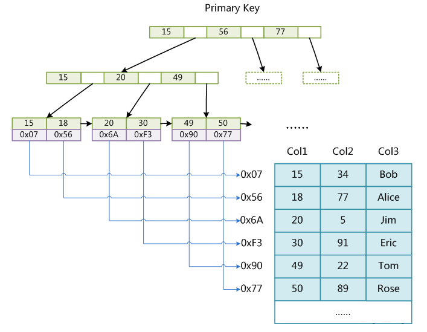

#*mysql*索引底层数据结构与算法
##innodb 结构文件
.frm,.
##myisam 结构文件

.myi,.myd

索引的本质：索引是帮助mysql高效获取数据的*排好序*的*数据结构*
索引最左缀原则
索引的数据结构:二叉树,红黑树,Hash表,B-Tree

###B-Tree:

叶节点具有相同的深度，叶节点的指针为空

所有索引元素不重复

节点中的数据索引从左到右递增排列

###B+Tree(B-Tree变种)

非叶子节点不存储data，只存储索引(冗余)，可以放更多的索引

叶子节点包含所有索引字段

叶子节点用指针连接，提高区间访问的性能

###MyISAM存储引擎索引实现
MyISAM索引文件和数据文件是分离的(非聚集)

###InnoDB存储引擎索引实现

InnoDB索引实现(聚集)
表数据文件本身就是按B+Tree组织的一个索引结构文件

聚集索引-叶节点包含了完整的数据记录

为什么InnoDB表必须有主键，并且推荐使用整型的自增主键？

为什么非主键索引结构叶子节点存储的是主键值？(一致性和节省存储空间)

